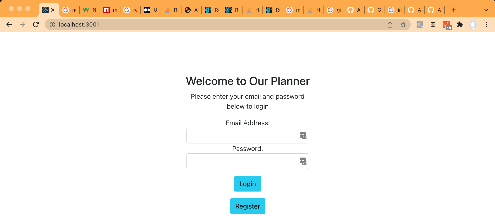
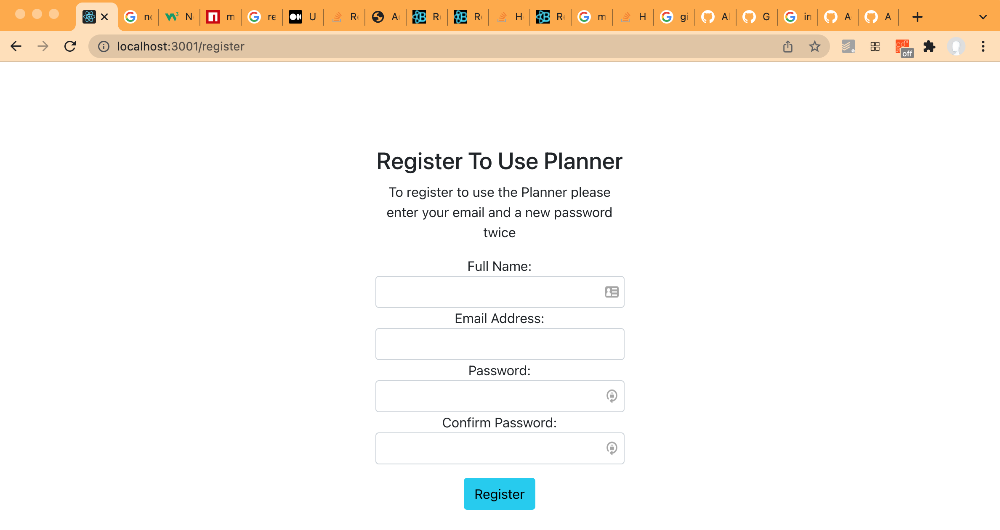
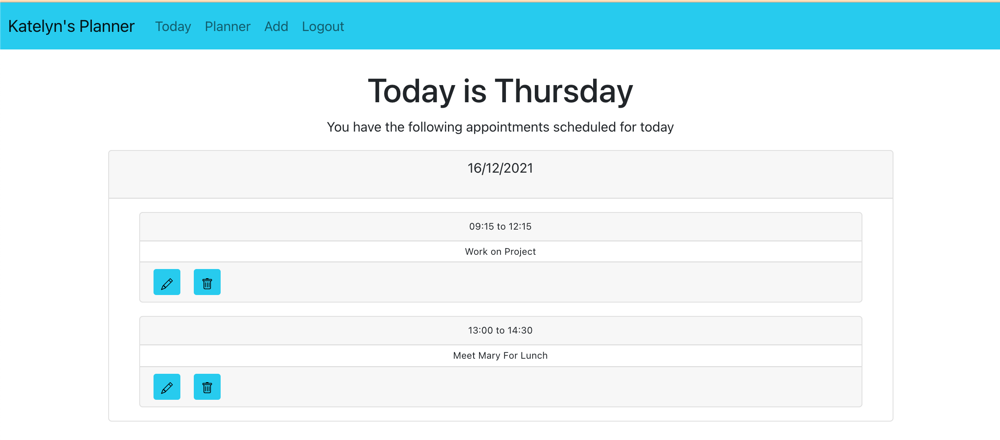
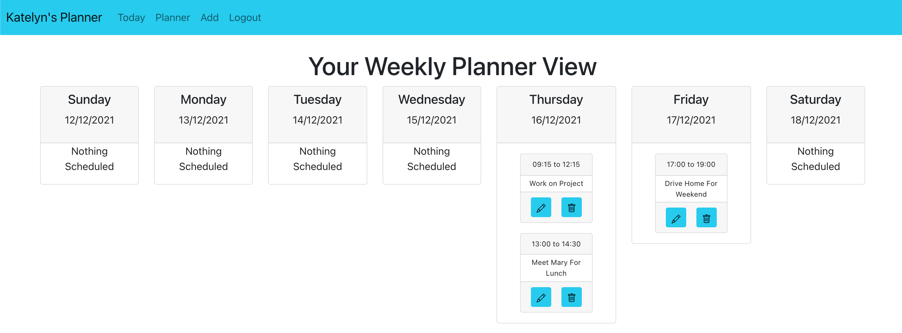
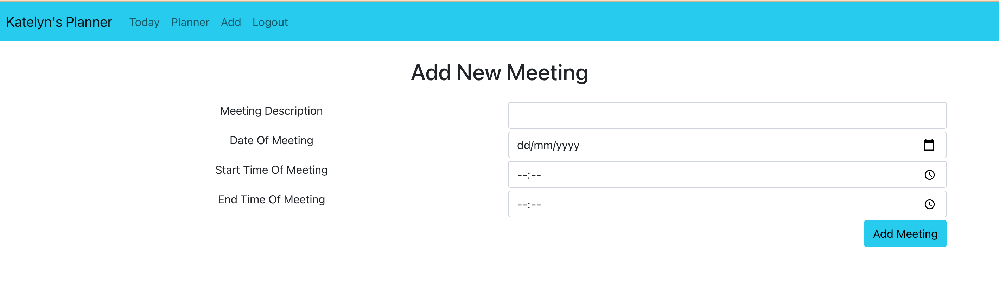
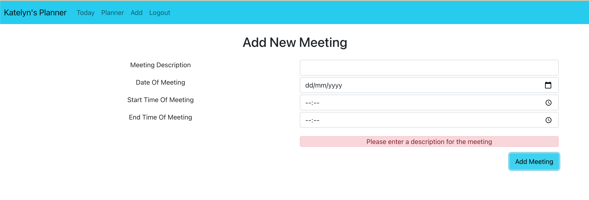
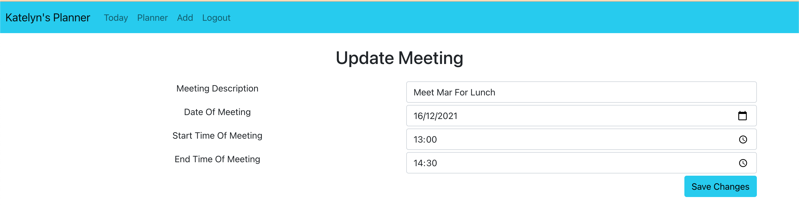
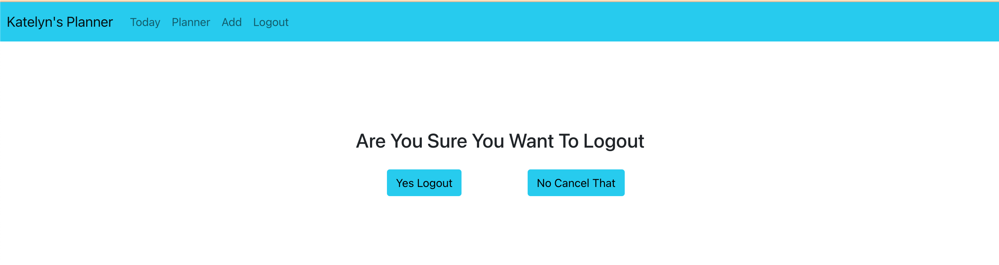

# Introduction

This is the project submission for Katelyn Graham and represents a simple Weekly Planner Application that can
be used by people to record and track their appointments. The code base for the project is made up of two main parts:

- *Back End* - this is the back end rest server logic
- *Front End* - this is a web based application implemented using React 

These two main elements of the solution are describer in more detail in the following sub-sections.

# Installation
To install the application run the command `npm install` from the project root folder.

# Solution Overview
## Back End
This server provides a REST API to the Front End Application with the following main pieces of functionality:

- *Login*: Access to the Planner application requires users to provide a valid email and associated password 
- *Registration*: new users can register and sign up to use the system by providing their Name, EMail address and password.
- *Meetings*: Once logged in a person can add new meetings/ appointments,  edit existing ones, and delete/ remove them using the Front End. The server provides a set of API operations to support this.

The *Back End Server* uses Express to implement the API calls, and it uses MongoDB to store the user and meetings data.
The code for the *Back End Server* is located in a single file here: `BackEnd/server.js`.
To launch the server from within the project root folder simply run he comment `node BackEnd/server.js`. By default the server listens on port 4000, running on localhost.

## Front End
The front end web application is implemented using React and the initial skeleton of code was created using the utility `Create React App`.
The source code for the web application is located within the `src` directory and to launch it you can run the command `npm start` from within the project root folder. 
The front end application contains the following main screens.

### Screen Login
If the user has an account then they can enter their email address and password here.

### Screen Register
Alternatively if this is a new user, they can click the Register button on the login page and and create a new account for themselves.

### Screen Today
Once logged in the user is shown the `Today` screen which lists any appointments/ meetings that they have set up for today.

### Screen Planner
Across the top you will also see various menu options. If you click on the Planner menu option then it will show you the screen below which is a full view of the current week, day by day listing all meetings/ appointments.

### Screen Add
Also across the top of the screen you will see the `Add` menu opton which you can use to add new meetings to your planner. When you select the Add menu option you will see the screen below where you can provide meeting details. This includes a Description, Date, Start Time and End Time.

The logic associated with this screen also validates the data that is entered to make sure that all fields are filled out correctly, and if not then a suitable error message is displayed.

### Screen Update
You should notice that for each existing Meeting on the Planner or Today screen there is a small blue Pencil icon button. If you click this button them you can update the contents of that specific meeting (See example screen below). 

You will also see a small blue Trash icon which you can use to delete a meeting from your planner.

### Screen Logout
Finally if you wish are finished then you can click the `Logout` menu option to logout, where you will be prompted to confirm that you want to logout.

